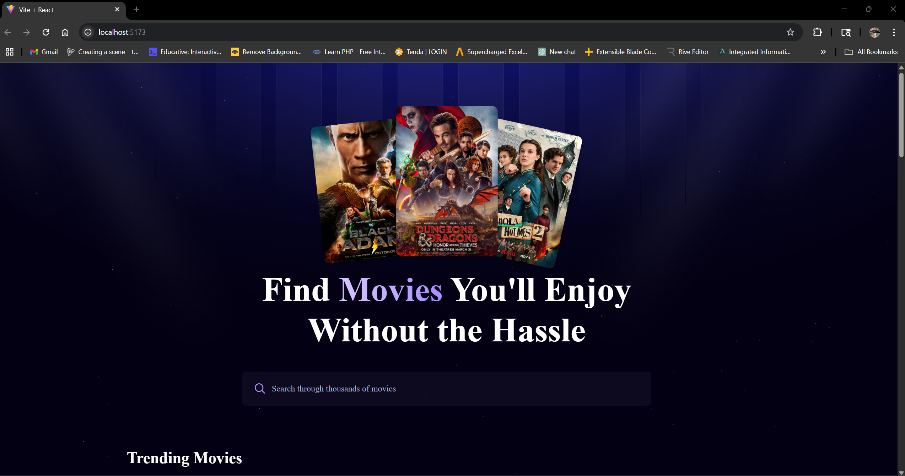

# First React App

## Overview
This is my React application, a dynamic single-page app built with `React.js v19`. 
The app fetches and displays movie data using the `TMDB free movie API`, stores search trends in an `AppWrite` 
cloud database, and features a modern, responsive UI styled with `TailwindCSS v4`. Key features include a debounced 
search functionality for optimized API calls and a trending movies section displaying the most searched movies 
from the database. This project demonstrates my ability to integrate front-end frameworks, external APIs, 
cloud-based backends, and performance optimizations into a cohesive web application.
<div class = "container">
    <div style="margin-bottom: 30px">
        
        <figcaption style="font-style: italic">First image of the app</figcaption>
    </div>
    <div style="margin-bottom: 30px">
        
        <figcaption style="font-style: italic">Second image of the app</figcaption>
    </div>
</div>

## Features
>Debounced Search: A search bar with 500ms debouncing to reduce API calls, improving performance and user experience.

>Trending Movies Section: Displays the most searched movies, fetched from the AppWrite database using search count data.

>Dynamic Movie Data: Retrieves and renders movie details from the TMDB API.

>Responsive Design: A sleek, mobile-friendly UI styled with TailwindCSS v4’s utility-first classes.

>Backend Integration: Uses AppWrite to store and retrieve search data, enabling trending movie functionality.

>Component-Based Architecture: Modular React components for reusability and maintainability.

>State Management: Leverages React hooks (useState, useEffect) and react-use for efficient state and side-effect 
handling.

## Skills Demonstrated
`React.js V19` : Building reusable components, managing state with hooks, and integrating third-party libraries like `react-use`

`TailwindCSS V4` : Creating responsive, utility-first designs for a modern UI. 

`AppWrite`: Managing cloud-based database operations for storing and retrieving search trends.

`TMDB API` : Fetching and handling external API data with error handling and async operations.

`Performance Optimization` : Implementing debounced search to minimize API requests.

`Problem solving` : Integrating multiple technologies to deliver a feature-rich application.

## Future Improvements
As I continue to grow as a developer, I plan to enhance this project by:

<ul>
<li>Adding advanced search filters(eg, by genre or release year)</li>
<li>Implementing user authentication with AppWrite for personalized features</li>
<li>Optimizing database queries and API calls for faster performance</li>
<li>Enhancing accessibility and UI/UX with TailwindCSS</li>
</ul>

## Installation
Clone the project
```bash
git clone https://github.com/Brian-001/first-react-app.git
```
Navigate to the project directory:
```bash
cd first-react-app
```
Install Dependencies
```bash
npm install
```
Set up environment variables
<ul>
<li>Create <b>.env.local</b> file in the root directory</li>
<li>Add your TMDB API key and AppWrite configuration</li>
</ul>

```bash
VITE_TMDB_API_KEY = 
VITE_APPWRITE_PROJECT_ID = 
VITE_APPWRITE_DATABASE_ID = 
VITE_APPWRITE_COLLECTION_ID = 
```
Re-run the server once more
```bash
ctrl + c
npm run dev
```

## License
This project is licensed under the MIT License.


